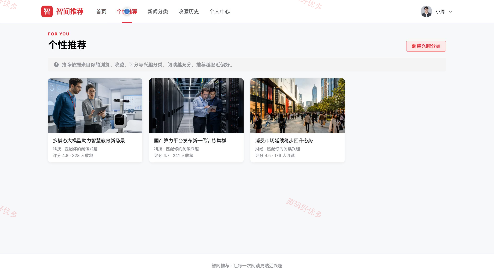
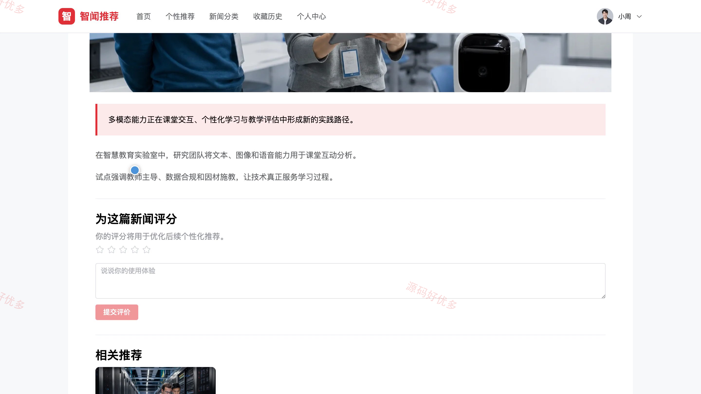
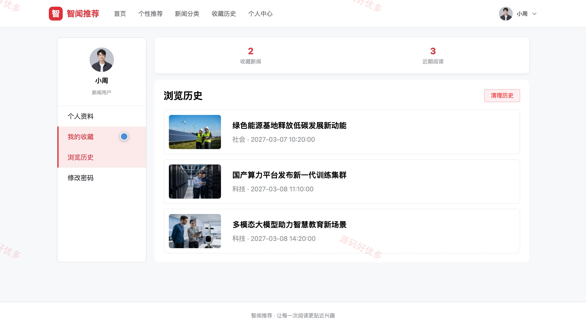
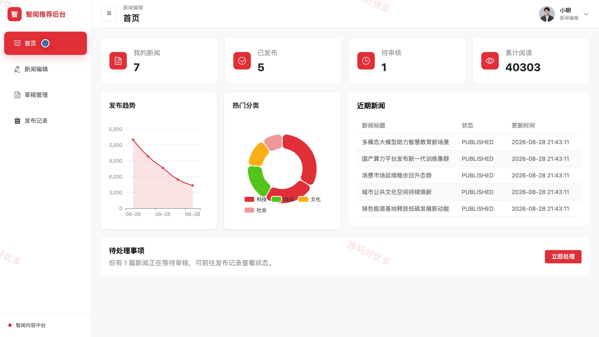
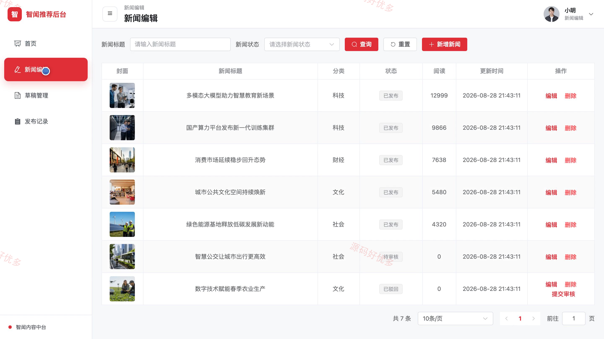
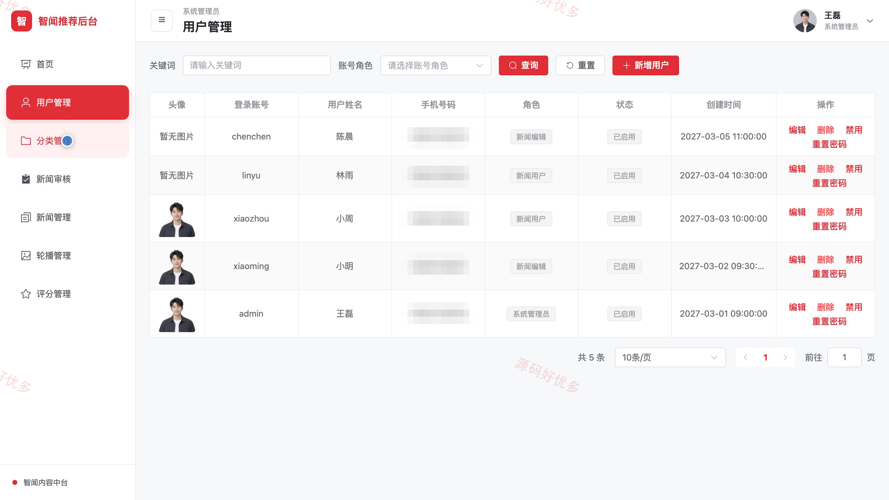
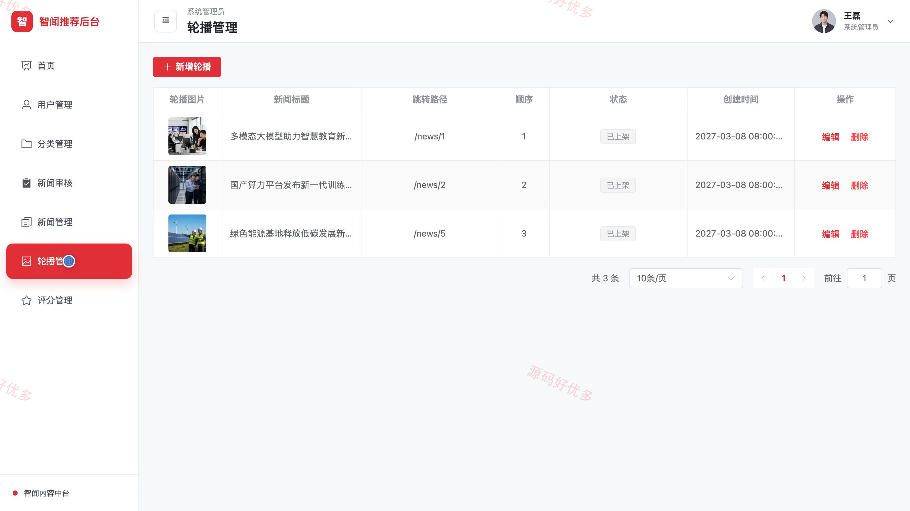

## 源码问题查看主页咨询

### 一、关键词
个性化新闻推荐、新闻资讯平台、智能内容推荐、新闻阅读、兴趣推荐

### 二、作品包含
源码+数据库+万字设计文档+PPT+全套环境和工具资源+本地部署教程

### 三、项目技术
前端技术： Html、Css、Js、Vue3.4、Element-Plus
后端技术：Java、SpringBoot3.2.0、MyBatis-Plus

### 四、运行环境（以下版本亲测，其他版本兼容性请自行测试）
开发工具：IDEA/eclipse + VSCODE

数据库：MySQL5.7+（共11张表）

数据库管理工具：Navicat10以上版本

环境配置软件： JDK17 + Maven3.6.3+

前端Nodejs：16+

浏览器：谷歌浏览器

### 五、项目介绍
项目编号：bs099A

该系统面向新闻阅读与内容运营场景，结合用户的兴趣分类、浏览、收藏和评分记录生成个性化推荐；新闻用户可浏览、搜索、收藏和评分内容，新闻编辑负责内容编辑、草稿与提审，系统管理员负责新闻审核、用户、分类、轮播、评分与运营数据维护。

角色：新闻用户、新闻编辑、系统管理员

新闻用户功能：注册登录与资料维护、新闻分类浏览与搜索、新闻详情与相关推荐、个性化新闻推荐、新闻收藏管理、浏览历史管理、新闻评分。

新闻编辑功能：内容后台登录、新闻内容编辑、个人草稿管理、新闻提交审核、新闻发布记录、内容数据概览。

系统管理员功能：系统后台登录、用户账号管理、新闻分类管理、新闻审核、新闻内容管理、首页轮播管理、新闻评分管理、运营数据统计。

### 六、运行截图

